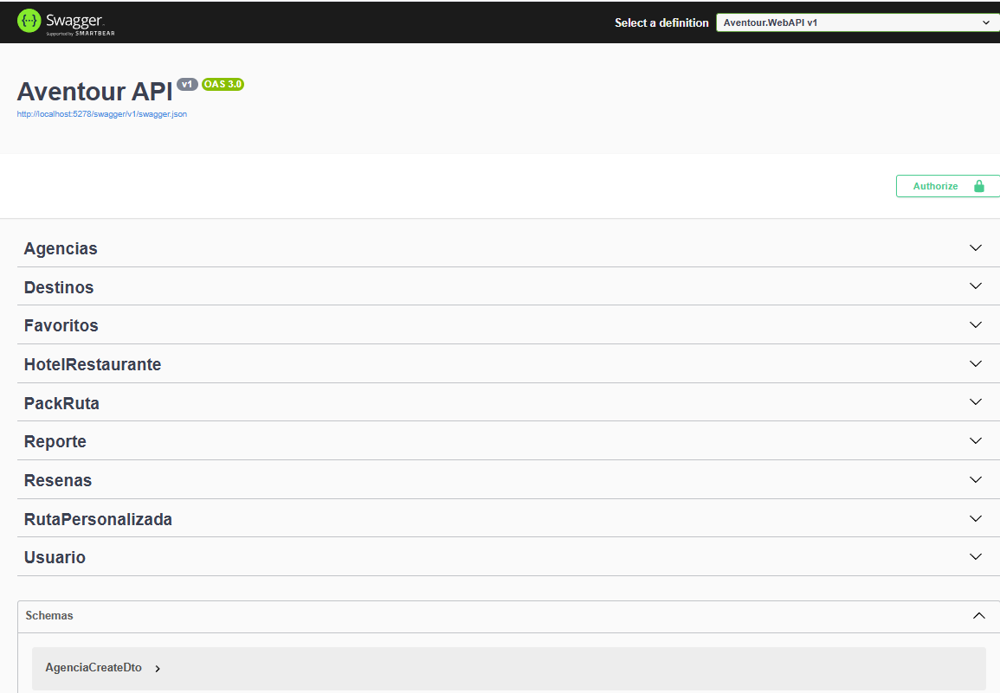

# 🌍 Aventour Backend API

<p align="center">
  
</p>

Bienvenido al backend de **Aventour**, una plataforma de gestión turística construida sobre **.NET 9**. Este proyecto sigue estrictamente los principios de **Arquitectura Hexagonal (Clean Architecture)** para garantizar la mantenibilidad, testabilidad y desacoplamiento de componentes.

## 🏗️ Arquitectura del Proyecto

El proyecto está modularizado siguiendo el patrón de **Puertos y Adaptadores**:

| Capa | Proyecto (.NET) | Responsabilidad | Dependencias |
| :--- | :--- | :--- | :--- |
| **Domain** | `Aventour.Domain` | El núcleo del negocio. Contiene Entidades, Enums y Excepciones de dominio. | *Ninguna (Pura)* |
| **Application** | `Aventour.Application` | Casos de uso, Servicios, Interfaces (Puertos), DTOs y Mappers. Orquestación lógica. | `Aventour.Domain` |
| **Infrastructure** | `Aventour.Infrastructure` | Implementación de adaptadores (BD, Seguridad, External APIs). | `Aventour.Application`, `Aventour.Domain` |
| **WebAPI** | `Aventour.WebAPI` | Punto de entrada (Adaptador Primario). Controladores REST y Configuración DI. | `Aventour.Application`, `Aventour.Infrastructure` |

### 🚀 Tecnologías Clave

* **Framework:** .NET 9.0
* **Base de Datos:** PostgreSQL (vía Npgsql)
* **ORM:** Entity Framework Core (Code-First)
* **Autenticación:** JWT (JSON Web Tokens) + BCrypt para hashing
* **Mapeo:** AutoMapper
* **Documentación:** Swagger / OpenAPI

---

## 🛠️ Instalación y Configuración

### Prerrequisitos
* [.NET 9 SDK](https://dotnet.microsoft.com/download)
* [PostgreSQL](https://www.postgresql.org/)

 
## 📚 Documentación de API

La documentación interactiva de los endpoints está generada automáticamente por **Swagger**.

* **URL Local:** `https://localhost:7198/swagger/index.html`

### Endpoints Principales

* **Auth:** Login y Registro de usuarios (JWT).
* **Agencias:** Gestión de agencias turísticas y guías.
* **Destinos:** CRUD de destinos turísticos.
* **Rutas:** Creación de rutas personalizadas y packs.
* **Reseñas:** Sistema de valoración de usuarios.

---

## 🧪 Estructura de Carpetas

```text
/Aventour
  ├── /Aventour.Domain          # Entidades (Usuario, Destino, etc.)
  ├── /Aventour.Application     # DTOs, Interfaces (Repositories/Services), UseCases
  ├── /Aventour.Infrastructure  # EF Core Context, Repositories Impl, JWT Logic
  └── /Aventour.WebAPI          # Controllers, Middlewares, Program.cs
